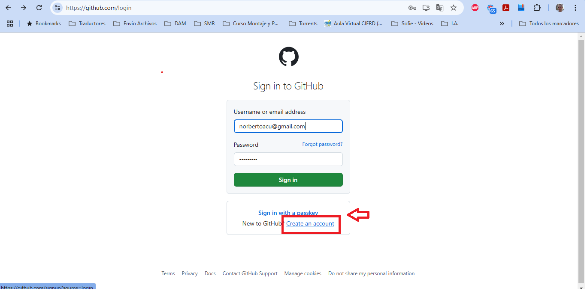
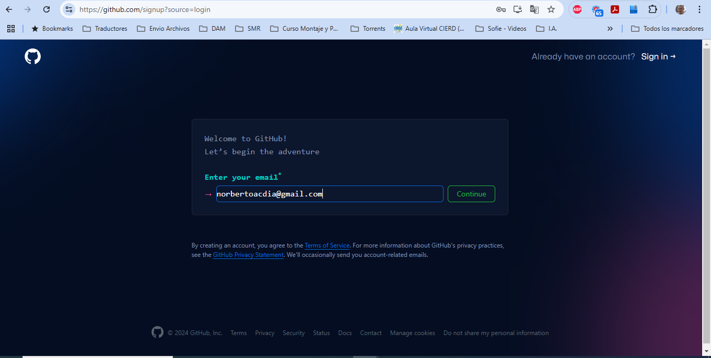
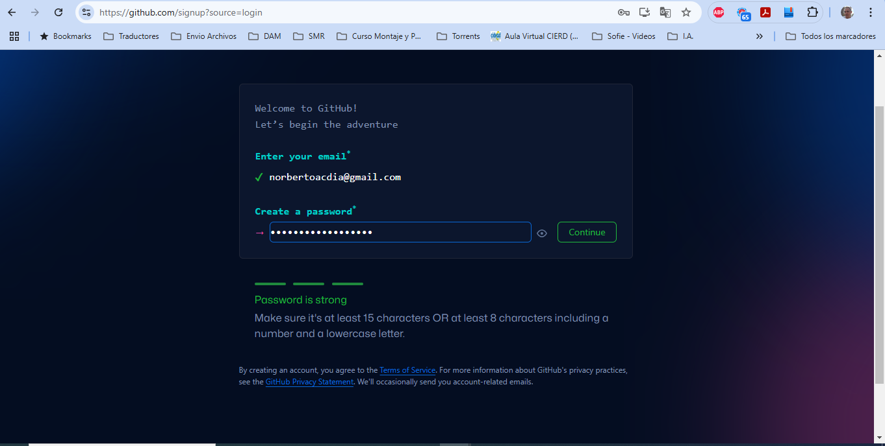
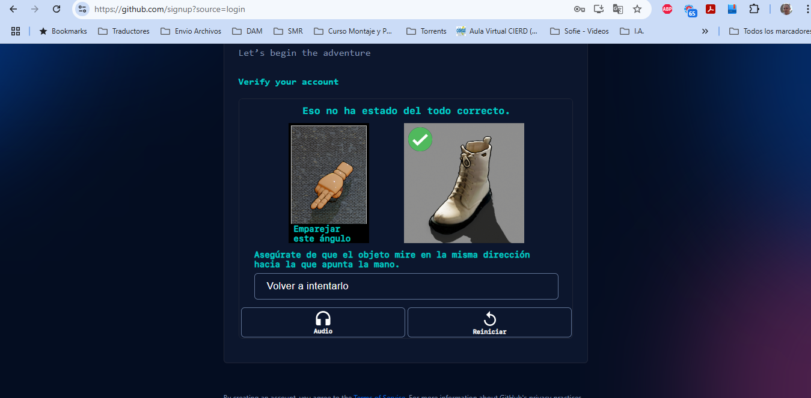
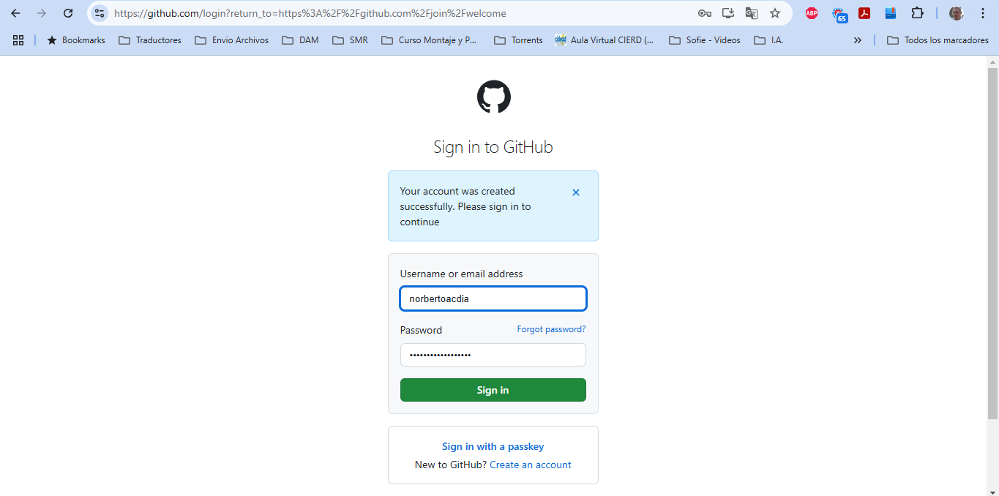
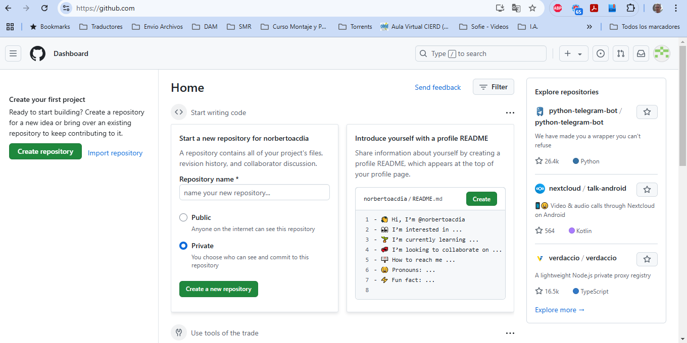

# Tarea_PIA01
#### Creación de cuenta de GitHub , pinchamos en el cuadrado rojo:
 
#### Una vez que pulsamos en account, nos aparece la siguiente pantalla donde introducimos la cuenta de email, en este caso:
#### norbetoacdia@gmail.com

#### Asignamos un password:

#### Pasamos controles anti-bots:

#### Nos identificamos con la nueva cuenta creada:

#### Pantalla principal GitHub

#### Creamos un repositorio Publico:

 
